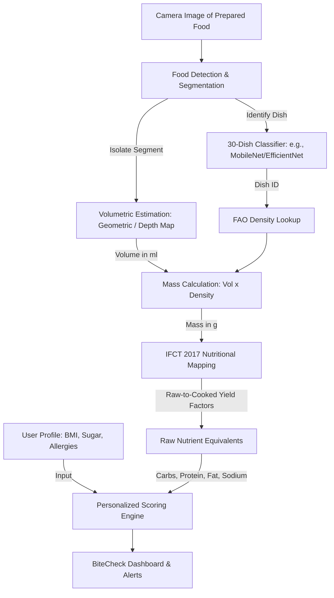

# Technical Feasibility Study & Implementation Roadmap: BiteCheck
This document outlines the technical scope, feasibility, and step-by-step roadmap for building the **BiteCheck** system. It evaluates the challenge of moving from a 30-dish classifier to volumetric weight estimation and final nutritional breakdown.

---

## 1. System Architecture Pipeline
The diagram below illustrates the proposed data flow from camera capture to personalized health rating:

---

## 2. Phase-by-Phase Complexity Analysis

### Phase 1: 30-Dish Food Classification
*Identify which dish is present on the plate from a target set of 30 common Indian food items.*

* **Technical Approach & Available Resources**: 
  * **Pre-trained Models**: We can use pre-trained **Vision Transformer (ViT)** models trained specifically on Indian cuisine. For instance, **`dima806/indian_food_image_detection`** on Hugging Face is pre-trained to classify **80 categories of Indian dishes** (including aloo gobi, biryani, chapati, dal makhani, dal tadka, gulab jamun, jalebi, naan, paneer butter masala, palak paneer, and poha). 
  * **Fine-Tuning**: If we want to restrict classification to exactly 30 target classes, we can either:
    1. Filter the outputs of the 80-class pre-trained model to map to our 30 dishes.
    2. Fine-tune a lightweight convolutional model (e.g. **MobileNetV3-Large** or **EfficientNetB0**) on a subset of the **SohlHealth/enhanced-indian-food-classification** dataset (15,000 images, 43 classes) or the **Khana dataset** (131,000+ images, 80 classes).
  * **Multi-Dish Detection**: For platters (Thalis), we can use a small object detector like **YOLOv11s** or **YOLOv12** to isolate individual dishes or katoris (bowls) on a plate before running classification on each region.
* **Feasibility**: **Very High**. Since we can leverage pre-trained Hugging Face transformers or PyTorch weights, we don't have to train a model from scratch. Inference can run on-device using ONNX or TensorFlow Lite.

> [!NOTE]
> **Complexity Rating: 2/10 (Low)**
> *Estimated Effort: 1–2 weeks (setting up the Hugging Face/TFLite inference pipeline and class mapping).*

---

### Phase 2: Volumetric & Density-Based Mass Estimation
*Determine the volume of the detected food and convert it to mass (grams) using density values.*

Here, we compare the two volumetric estimation strategies:

| Metric | Option A: Geometric Approximation | Option B: Monocular 3D Reconstruction |
| :--- | :--- | :--- |
| **Description** | Fits 2D contours to 3D primitive shapes (cylinder, sphere, disk) based on camera-to-plate scale calibration. | Generates a dense depth map from a single image, reconstructs a 3D mesh, and calculates voxel volume. |
| **Scientific/Industry Standing** | Standard engineering baseline for commercial diet apps (e.g., Lose It!, MyFitnessPal research prototypes). | State-of-the-art academic frontier (e.g., MFP3D, VolETA/NeuS2 papers, 2024–2026). |
| **Inference Location** | **On-Device (Offline-friendly)**. Fast, runnable in milliseconds on a mobile processor. | **Server-side (Cloud-dependent)**. Slow, requires GPU compute nodes to run depth models and mesh integrations. |
| **User Constraints / UI** | Requires a known reference (e.g., plate rim or standard bowl diameter) and a semi-top-down camera angle ($\approx 45^\circ - 60^\circ$). | Requires keyframes/video or specific reference markers to overcome absolute scale ambiguity. |
| **Accuracy (MAPE)** | $30\% - 50\%$ average error (depends heavily on plate/bowl shape standardization). | $10\% - 40\%$ average error (significantly higher accuracy for irregular or piled food shapes). |
| **Implementation Complexity** | **Low-Medium**. Simple OpenCV contour detection + mathematical formulas. | **Very High**. Involves depth estimation neural networks, point cloud triangulation, and coordinate mapping. |

#### Detailed Technical Comparison: Where & Why to Stand

##### 1. Option A: Geometric Approximation (The Practical Baseline)
* **How it works**:
  1. The user captures a picture of the food plate.
  2. The system detects the circular or elliptical plate rim using Hough Circle Transform or an ellipse detector. Standard plate diameter (e.g., $26\text{ cm}$) acts as a calibration reference to calculate the pixel-to-metric scale ($S = \text{pixels}/\text{cm}$).
  3. Based on the classified dish type, the system applies a shape profile:
     * **Breads (Roti, Naan)**: Modeled as a flat disk. $\text{Volume} = \pi \times r^2 \times t$, where $t \approx 0.3\text{ cm}$ (constant thickness prior).
     * **Bowls (Dal, Curries)**: Modeled as a cylinder or truncated cone. Radius $r$ is derived from the bowl contour; height $h$ is assumed from a standard katori height ($4\text{ cm}$) or predicted based on the filled portion.
     * **Sweets/Snacks (Samosa, Gulab Jamun)**: Modeled as spheres or triangular prisms.
  4. Volume is multiplied by the density from the FAO database.
* **Why choose it**: It is highly robust, executes instantly without internet connectivity, and is very easy to debug. It is perfect for an MVP because it delivers a reasonable estimate with minimal engineering overhead.

##### 2. Option B: Monocular 3D Reconstruction (The Academic Frontier)
* **How it works**:
  1. The image is passed to a Monocular Depth Estimation network (such as **Depth Anything V2-Small** or **MiDaS**).
  2. The network outputs a relative depth map.
  3. The relative depth map is back-projected into a 3D point cloud using estimated or camera intrinsic parameters:
     $$Z_c = \text{depth}, \quad X_c = \frac{(u - u_0) \times Z_c}{f_x}, \quad Y_c = \frac{(v - v_0) \times Z_c}{f_y}$$
  4. Plate boundaries or visual priors are used to resolve the global scaling factor, converting relative depth to absolute metrics (centimeters).
  5. The point cloud is converted into a 3D mesh (via Delaunay triangulation or voxel grids), and the volume of the closed mesh is integrated.
* **Why choose it**: It is the only way to accurately estimate the volume of irregular foods (e.g. rice piles, biryani heaps, or scrambled items) where geometric primitives fail. However, it requires server hosting for the depth models and is prone to errors if the camera angle or lighting changes.

#### Mass Calculation & Density Lookup
Once volume ($V$) is determined, mass ($M$) is calculated as:
$$M = V \times \text{density}$$
We will maintain a local **Density Lookup Database** derived from the **FAO/INFOODS Density Database** and culinary literature:

| Food Item | Typical Physical Shape | Avg. Density ($\text{g/cm}^3$ or $\text{g/ml}$) | Notes / Conditions |
| :--- | :--- | :--- | :--- |
| **Steamed Rice** | Truncated Cone (in bowl) | 0.23 – 0.25 | Density index for loose cooked rice |
| **Dal / Sambhar** | Cylinder (in bowl) | 0.81 – 0.85 | Cooked liquid consistency |
| **Idli** | Spheroid Segment | 0.60 – 0.80 | Aerated; depends on fermentation |
| **Roti / Chapati** | Flat Disk | 0.40 – 0.50 | Dry weight relative to surface area |

> [!WARNING]
> **Complexity Rating: 5/10 (Geometric Option) | 8/10 (3D Reconstruction Option)**
> *Estimated Effort: 3–6 weeks (implementing scale calibration, geometric modeling, and density lookup table).*

---

### Phase 3: Nutritional Breakdown & Health Scoring
*Map the calculated mass (grams) of the cooked dish to its macronutrient/micronutrient breakdown and customize it to user health profiles.*

* **Technical Approach**:
  * **Database Integration**: Store a clean local SQL/CSV database using the **Indian Food Composition Tables (IFCT 2017)** which catalogs macronutrients (carbs, protein, fats, fiber) and micronutrients (sodium, sugar, etc.) for 528 foods.
  * **Raw-to-Cooked Adjustment**: Since IFCT contains values mostly for *raw* ingredients, we apply **Yield Factors (YF)**:
    $$\text{Raw Equivalent Weight} = \frac{\text{Cooked Weight}}{\text{Yield Factor}}$$
    *Example*: Steamed Rice has a yield factor of $\approx 3.0$ (absorbs water). If the model estimates $150\text{g}$ of cooked rice, the raw equivalent is $50\text{g}$.
  * **Nutrient Extraction**: Map the raw weight to the database to calculate total Carbs, Protein, Fat, and Sodium.
  * **Health Scoring Engine**: Compare these values against the user's profile limits:
    * *High blood pressure*: Alert on high Sodium items.
    * *Diabetes*: Evaluate glycemic load based on Carbs/Fiber ratio.
    * *Allergies*: Cross-reference ingredients with known food allergies.
* **Feasibility**: **Very High**. This is primarily database querying and rule-based logic. The main effort lies in data curation and structuring the lookup rules.

> [!NOTE]
> **Complexity Rating: 4/10 (Medium)**
> *Estimated Effort: 2 weeks (database extraction, yield factor calculations, scoring rules).*

---

## 3. Overall Feasibility Summary

| Component | Difficulty | Core Technology | Risk / Dependency |
| :--- | :--- | :--- | :--- |
| **30-Dish Image Classifier** | **Easy** | MobileNetV3 / EfficientNet | Low. Requires good training images. |
| **Scale & Plate Detection** | **Medium** | OpenCV (Ellipse/Hough circles) | Medium. Requires the user to take images at specific angles. |
| **Volume to Weight (Density)** | **Medium-High** | Geometric priors + FAO Table | Medium. High intra-class density variance (e.g. wet vs. dry dal). |
| **Nutrient Mapping (IFCT)** | **Easy** | SQLite, IFCT 2017 Dataset | Low. Just database retrieval and YF math. |
| **User Personalization** | **Easy** | Rule Engine | Low. Standard healthcare recommendation rules. |

### Technical Verdict
Building a reliable **MVP (Minimum Viable Product)** using **30-class recognition + Geometric Volume Estimation + IFCT 2017 Lookup** is **highly feasible** for a student major project or a startup prototype. 
* **Total Timeline**: $\approx$ **7 to 11 weeks** for a team of 2–4 developers.
* **Primary Pitfall**: Trying to do server-side 3D mesh reconstruction (NeuS2/VolETA) in the first iteration. It is computationally expensive and slow. **Recommendation**: Stick to geometric shape approximations with standard plate size calibration for the initial product.
