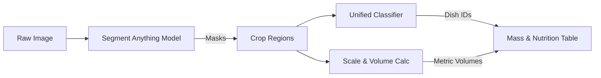

# Project BiteCheck: Multi-Dish Recognition, Volumetric Quantification & Research Strategy
*A Guide for Group Implementation and Academic Paper Publication*

This document serves as the technical implementation plan for our group project. It outlines how to fine-tune a unified model, how to solve the "Thali Problem" using a multi-step pipeline, and where the primary research gaps lie for publishing academic papers.

---

## 1. Group Guide: Fine-Tuning a Single Unified Model
Instead of loading multiple pre-trained models in parallel (which is slow and memory-intensive), we will train a **single unified classification model** optimized for our custom list of dishes.

### The Workflow:
```
[Gather Datasets] --> [Merge & Clean Classes] --> [Load Pre-trained Backbone] --> [Replace Output Head] --> [Fine-Tune Model]
```

### Step-by-Step Guide for the Group:
1. **Define the Target Classes**:
   Choose exactly $N$ classes (e.g., 30 dishes) representing a balance of North/South Indian staples and desserts.
2. **Prepare the Data**:
   * Gather image subsets from open sources:
     * **SohlHealth/enhanced-indian-food-classification** (43 classes)
     * **Khana Dataset** (80 classes)
     * **Kaggle Indian Food Images**
   * Structure folders locally:
     ```text
     dataset/
       train/
         idli/ (300+ images)
         dosa/ (300+ images)
         ...
       val/
         idli/ (50+ images)
         dosa/ (50+ images)
     ```
3. **Choose the Backbone Model**:
   * **For Web/Server App**: Use a Vision Transformer (**`google/vit-base-patch16-224`**). It achieves higher accuracy by capturing food texture.
   * **For Mobile App**: Use a CNN (**`MobileNetV3-Large`** or **`EfficientNetB0`**). It is smaller, faster, and runs locally.
4. **Modify the Output Head**:
   Load the pre-trained weights, freeze the early feature-extraction layers, and replace the final classification layer (the "head") to output our custom class count ($N$).
5. **Run the Fine-Tuning**:
   Train the modified model in Google Colab (using a free T4 GPU) for 5–10 epochs using AdamW optimizer. Since the model already understands basic shapes and colors, fine-tuning will take less than 2 hours.

---

## 2. Solving the "Thali Problem" (Multi-Dish Pipeline)
When a user takes a picture of a thali, a single-label classifier will fail. We must implement a three-step pipeline: **Segregate $\rightarrow$ Crop & Classify $\rightarrow$ Volumetric Estimation**.



### Step 1: Segregate (Mask Generation)
We run the image through a segmentation model to detect individual boundaries:
* Use the **Segment Anything Model (SAM)** by Meta. SAM is class-agnostic, meaning it does not need to know what the food is to find its outline. It will return a set of mask coordinates for the plate, the rice, each katori (bowl), and the rotis.

### Step 2: Crop and Classify
* The program crops each segmented region of interest (ROI) from the original image.
* Each crop is sent to our **Unified Classifier** (Step 1) to determine the dish label (e.g., Dal, Palak Paneer, Rice, Roti).

### Step 3: Volumetric Estimation (Calculating Amounts)
1. **Pixel-to-Centimeter Calibration**:
   The system detects the boundary of the plate. Assuming a standard thali diameter of $26\text{ cm}$, we calculate the conversion factor:
   $$1\text{ cm} = \frac{\text{Plate Diameter in Pixels}}{26}$$
2. **Apply Geometric Volume Formulas**:
   * **Bowls (Dal/Curries)**: Treat as cylinders. Measure the radius ($r$) of the bowl mask in cm. Assume a standard katori depth ($h = 4\text{ cm}$).
     $$\text{Volume} = \pi \times r^2 \times h$$
   * **Rice Piles**: Treat as cones. Measure the radius ($r$). Assume pile height is a ratio of radius ($h \approx 0.5 \times r$).
     $$\text{Volume} = \frac{1}{3} \times \pi \times r^2 \times h$$
   * **Flatbreads (Rotis)**: Treat as thin cylinders. Compute mask area ($A$) in $\text{cm}^2$. Assume thickness ($t = 0.3\text{ cm}$).
     $$\text{Volume} = A \times t$$
3. **Mass Conversion**:
   Convert volume ($V$) to mass ($M$) using density ($\rho$):
   $$\text{Mass (g)} = \text{Volume (ml)} \times \text{Density (g/ml)}$$

---

## 3. Academic Research Gaps & Paper Publishing Opportunities
To publish a paper, you must address issues that current literature has not fully solved. Here are the three primary research gaps in Indian culinary analysis:

### 🔍 Gap 1: Scale Calibration Without Reference Markers
* **The Problem**: Current volumetric models require a physical calibration marker (e.g., placing a coin next to the plate or scanning a QR code) or assume a perfectly circular plate viewed from a direct $90^\circ$ angle. In real-world dining, users take photos at arbitrary angles ($30^\circ - 60^\circ$) under diverse perspectives.
* **Research Angle**: Develop a **self-calibrating camera perspective model**. By analyzing the elliptical distortion of the plate rim (projected circle to ellipse under perspective projection), the system can mathematically estimate the camera's tilt angle and distance without external markers.
* **Paper Contribution**: *"Self-Calibrating Perspective Correction for Markerless Food Volumetric Estimation."*

### 🔍 Gap 2: 3D Height-Map Estimation for Amorphous Foods
* **The Problem**: Geometric shape approximations fail on irregular piles (like biryani heaps, scrambled paneer, or mixed vegetables). They assume uniform height, leading to volume errors up to $50\%$.
* **Research Angle**: Combine Monocular Depth Estimation (e.g., *Depth Anything V2*) with semantic segmentation. Train a lightweight regressor that predicts a **continuous 3D height map** (a digital elevation model) specifically for food piles, using localized texture shading features.
* **Paper Contribution**: *"RGB-D Fusion for Volumetric Estimation of Amorphous Indian Foods Using Monocular Depth Refinement."*

### 🔍 Gap 3: Texture-Driven Density Adjustments
* **The Problem**: Food density is not constant. For example, a fermented *idli* has different density (due to air pockets) than an unfermented one; cooked rice density depends on moisture retention.
* **Research Angle**: Create a model that evaluates the **visual texture** (e.g. aeration bubble count in idlis, moisture glaze in curries) using deep visual features and applies a **correction multiplier** to the static density lookup tables.
* **Paper Contribution**: *"Texture-Driven Density Correction Models for Precision Dietary Mass Estimation."*

---

## 4. Proposed Timeline & Division of Labor

| Phase | Tasks | Assigned to | Complexity |
| :--- | :--- | :--- | :--- |
| **Phase 1** | Data collection, fine-tuning the unified classifier, building Streamlit UI. | Member A & B | Low |
| **Phase 2** | Integrating SAM/YOLO-Seg to crop individual dishes on the thali. | Member C | Medium-High |
| **Phase 3** | Ellipse-based perspective correction and geometric volume calculation. | Member D (Lead Researcher) | High |
| **Phase 4** | Database mapping (IFCT 2017), nutrition table output, paper drafting. | All members | Medium |

> [!TIP]
> **Recommended Publication Target**: 
> You can target computer vision workshops at conferences like **CVPR (Multi-Modal Food Analysis Workshop)** or journals like **IEEE Access** or **Computers in Biology and Medicine**. Focus your paper's introduction on the complexity of "Indian Thalis" compared to Western food datasets.
